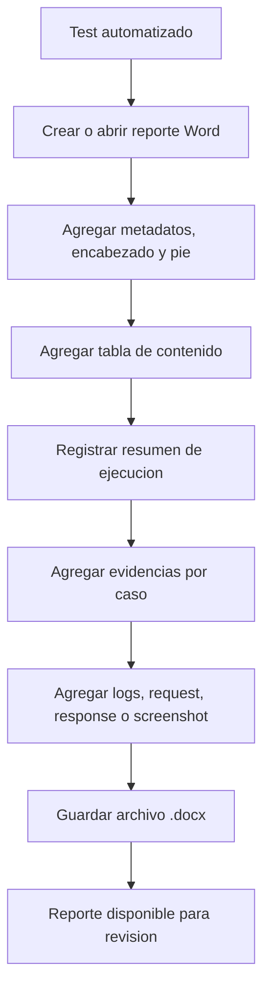
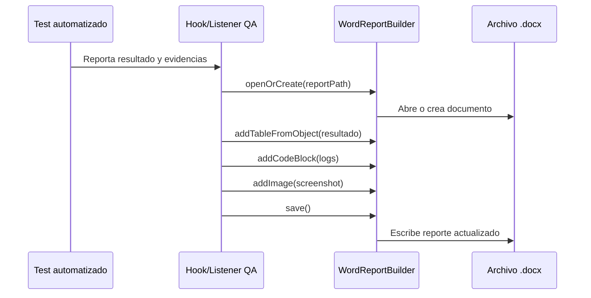

# QA Word Report Builder

Utilidad Java 21 para generar documentos Word (`.docx`) orientados a reportes, evidencias y resultados de automatizacion QA.

El proyecto encapsula Apache POI detras de una API fluida para que los tests, suites o hooks del framework QA puedan generar reportes sin depender directamente de detalles internos de Word.

## Objetivo

Crear documentos Word reutilizables y mantenibles para documentar:

- Casos de prueba ejecutados.
- Resultados por escenario o suite.
- Evidencias tecnicas de APIs.
- Logs, requests, responses y stack traces.
- Datos de entrada y salida.
- Capturas de pantalla.
- Reportes acumulativos sobre un mismo archivo `.docx`.

## Stack tecnico

- Java 21
- Maven
- Apache POI `poi-ooxml`
- Log4j Core como dependencia runtime para Apache POI

## Estructura del proyecto

```text
.
|-- pom.xml
|-- README.md
`-- src
    `-- main
        `-- java
            `-- com
                `-- example
                    `-- qa
                        |-- demo
                        |   `-- WordReportExample.java
                        `-- word
                            |-- HeadingLevel.java
                            |-- WordReportBuilder.java
                            `-- WordReportException.java
```

## Clase principal

La clase central es `WordReportBuilder`.

Permite:

- Crear documentos nuevos.
- Abrir documentos existentes.
- Abrir o crear documentos para agregar contenido acumulativo.
- Agregar titulos y encabezados con estilos reales de Word.
- Insertar tabla de contenido automatica.
- Simular secciones colapsables mediante encabezados.
- Insertar parrafos, listas, separadores y saltos de pagina.
- Insertar bloques tipo consola/codigo.
- Construir tablas dinamicas desde objetos, records, beans, mapas y listas.
- Insertar imagenes.
- Agregar evidencias QA de pruebas y APIs.
- Guardar el documento en la misma ruta o exportarlo con otro nombre.

## Flujo general de uso



## Arquitectura conceptual

```mermaid
classDiagram
    class WordReportBuilder {
        +create(Path)
        +open(Path)
        +openOrCreate(Path)
        +withMetadata(String, String, String)
        +addHeading(String, HeadingLevel)
        +addTableOfContents()
        +addCollapsibleSection(String, HeadingLevel, Consumer)
        +addParagraph(String)
        +addCodeBlock(String)
        +addTableFromObject(Object)
        +addTableFromObjects(List)
        +addTableFromMap(Map)
        +addTableFromMaps(List)
        +addImage(Path, int, int)
        +addRequestResponseEvidence(String, String, String, int, long)
        +save()
        +saveAs(Path)
    }

    class HeadingLevel {
        TITLE
        SUBTITLE
        SECTION
        SUBSECTION
    }

    class WordReportException {
        +WordReportException(String)
        +WordReportException(String, Throwable)
    }

    WordReportBuilder --> HeadingLevel
    WordReportBuilder --> WordReportException
    WordReportBuilder ..> "Apache POI XWPF"
```

## Casos de uso

### 1. Crear un reporte nuevo por ejecucion

Util para suites independientes, ejecuciones CI/CD o reportes limpios por corrida.

```java
Path reportPath = Path.of("target", "reports", "qa-execution-report.docx");

try (WordReportBuilder report = WordReportBuilder.create(reportPath)) {
    report.withMetadata(
                    "Reporte QA",
                    "Evidencia de ejecucion automatizada",
                    "QA Automation Team"
            )
            .addHeading("Reporte de ejecucion QA", HeadingLevel.TITLE)
            .addExecutionDate()
            .addTableOfContents()
            .addPageBreak()
            .addHeading("Resumen", HeadingLevel.SECTION)
            .addParagraph("Suite ejecutada correctamente.")
            .save();
}
```

### 2. Agregar contenido sobre el mismo archivo Word

Util para reportes acumulativos, por ejemplo cuando diferentes tests van agregando evidencias al mismo documento.

```java
Path reportPath = Path.of("target", "reports", "regression-report.docx");

try (WordReportBuilder report = WordReportBuilder.openOrCreate(reportPath)) {
    report.addPageBreak()
            .addHeading("Nueva ejecucion", HeadingLevel.SECTION)
            .addExecutionDate()
            .addParagraph("Se agregan resultados de una nueva corrida.")
            .save();
}
```

### 3. Documentar un caso de prueba

```java
record TestCaseResult(
        String id,
        String name,
        String status,
        long durationMillis,
        String observation
) {
}

try (WordReportBuilder report = WordReportBuilder.openOrCreate(reportPath)) {
    report.addCollapsibleSection("Caso: login exitoso", HeadingLevel.SECTION, section -> section
            .addTableFromObject(new TestCaseResult(
                    "TC-LOGIN-001",
                    "Login exitoso",
                    "PASSED",
                    1240,
                    "El usuario ingreso al dashboard correctamente."
            ))
            .addHeading("Validaciones", HeadingLevel.SUBSECTION)
            .addBulletList(List.of(
                    "El codigo HTTP fue 200.",
                    "El token fue generado.",
                    "El usuario fue redirigido al dashboard."
            )))
            .save();
}
```

### 4. Agregar evidencia tecnica de API

```java
report.addRequestResponseEvidence(
        "Evidencia API: autenticacion",
        """
        POST /api/login HTTP/1.1
        Content-Type: application/json

        {
          "username": "qa.user@example.com",
          "password": "***"
        }
        """,
        """
        HTTP/1.1 200 OK
        Content-Type: application/json

        {
          "status": "OK",
          "tokenType": "Bearer"
        }
        """,
        200,
        318
);
```

### 5. Generar tablas dinamicas

Desde un mapa:

```java
report.addTableFromMap(Map.of(
        "environment", "QA",
        "browser", "Chrome",
        "user", "qa.user@example.com"
));
```

Desde una lista de objetos:

```java
report.addTableFromObjects(List.of(
        new TestCaseResult("TC-001", "Login exitoso", "PASSED", 1240, "OK"),
        new TestCaseResult("TC-002", "Password invalido", "PASSED", 890, "Mensaje esperado"),
        new TestCaseResult("TC-003", "Usuario bloqueado", "FAILED", 1020, "No aparecio alerta")
));
```

## Tabla de contenido

La tabla de contenido se inserta como un campo de Word:

```java
report.addTableOfContents();
```

Microsoft Word calcula los numeros de pagina al abrir o actualizar el documento. Si el indice no aparece actualizado automaticamente, usa clic derecho sobre la tabla de contenido y selecciona `Actualizar campo`.

## Secciones colapsables

Word no maneja secciones colapsables como un componente independiente generado por Apache POI. La utilidad las simula usando estilos nativos de encabezado (`Heading1`, `Heading2`, `Heading3`) y niveles de esquema.

```java
report.addCollapsibleSection("Request / Response", HeadingLevel.SECTION, section -> section
        .addHeading("Request", HeadingLevel.SUBSECTION)
        .addCodeBlock(requestBody)
        .addHeading("Response", HeadingLevel.SUBSECTION)
        .addCodeBlock(responseBody)
);
```

## Flujo recomendado en un framework QA



## Ejecutar el ejemplo

Compilar:

```powershell
mvn compile
```

Ejecutar la clase de ejemplo:

```powershell
mvn exec:java
```

El ejemplo genera:

```text
target/reports/qa-execution-report.docx
```

## Generar Javadoc

```powershell
mvn javadoc:javadoc
```

La documentacion queda en:

```text
target/site/apidocs/index.html
```

## Recomendaciones de uso

- Usa `create(Path)` para reportes limpios por ejecucion.
- Usa `openOrCreate(Path)` para reportes acumulativos.
- Usa `saveAs(Path)` si abres una plantilla y quieres preservar el archivo original.
- Sanitiza datos sensibles antes de agregarlos al reporte: passwords, tokens, cookies y headers privados.
- Evita insertar imagenes demasiado grandes sin redimensionar.
- Mantén los tests desacoplados de Apache POI; usa `WordReportBuilder` como unica entrada.
- Centraliza la generacion del reporte en listeners, hooks o extensiones del framework QA.

## Posibles mejoras futuras

- Soporte para plantillas corporativas `.docx`.
- Colores por estado: `PASSED`, `FAILED`, `SKIPPED`, `BLOCKED`.
- Hipervinculos hacia evidencias externas.
- Exportacion a PDF.
- Sanitizacion automatica de secretos.
- Estilos configurables mediante una clase dedicada.
- Integracion directa con JUnit, TestNG, Cucumber, Selenium, Playwright o RestAssured.
